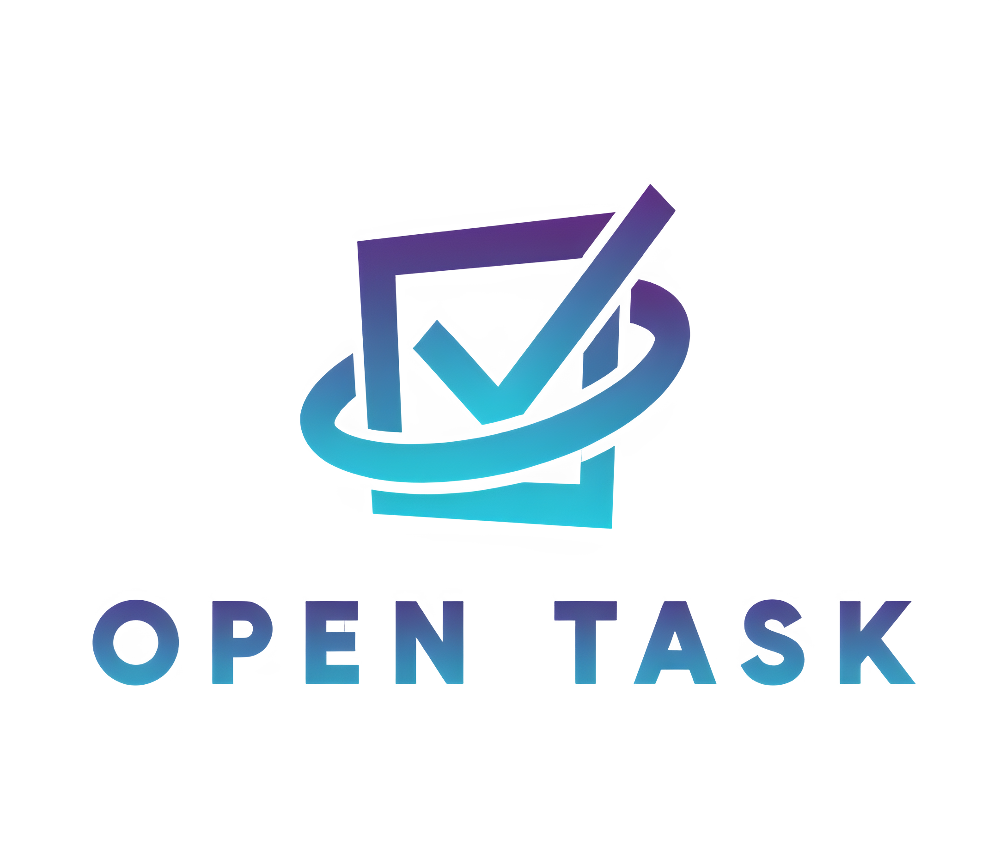

<div align="center">
  
</div>

# OpenTask - Decentralized Task Marketplace, an Alyra certification project

OpenTask is a decentralized marketplace for tasks and services built on the Ethereum blockchain. It connects task providers with developers and auditors in a trustless environment.

## 🏗 Project Structure

OpenTask/\
├── backend/ # Smart contracts and blockchain logic\
│ ├── contracts/ # Solidity smart contracts\
│ ├── scripts/ # Deployment scripts\
│ └── test/ # Contract test files\
│\
└── frontend/ # Next.js web application\
├── components/ # React components\
├── pages/ # Next.js pages\
└── public/ # Static assets\

## 🚀 Quick Start

### Prerequisites
- Node.js >= 16.0.0
- npm or yarn
- MetaMask wallet

### Backend Setup
```bash
cd backend
npm install
```

#### Key Commands


Compile contracts
```bash
npx hardhat compile
```
Run tests
```bash
npx hardhat test
```
Run test coverage
```bash
npx hardhat coverage
```

Deploy to local network
```bash
npx hardhat node
npx hardhat run scripts/deploy.js --network localhost
```

Deploy to testnet (Sepolia)
```bash
npx hardhat run scripts/deploy.js --network sepolia
```

### Frontend Setup

```bash
cd frontend
npm install
```

#### Key Commands


Run development server
```bash
npm run dev
```
Build for production
```bash
npm run build
```
Start production server
```bash
npm start
```
Run linter
```bash
npm run lint
```

## 🔧 Smart Contracts

The project includes several key smart contracts:
- `TaskMarketplace.sol`: Main marketplace contract
- `SoulBoundTokenRole.sol`: Role-based access control
- `SoulBoundAchievement.sol`: Achievement tracking
- `SoulBoundRedflag.sol`: Reputation system

## 🌐 Environment Setup

### Backend (.env)

```
PRIVATE_KEY=your_private_key
SEPOLIA_RPC_URL=your_sepolia_endpoint
ETHERSCAN_API_KEY=your_etherscan_key
```

### Frontend (.env.local)

```
NEXT_PUBLIC_CONTRACT_ADDRESS=deployed_contract_address
NEXT_PUBLIC_RPC_URL=your_rpc_url
```


## 🧪 Testing

The project includes comprehensive test suites for all smart contracts:
- Unit tests
- Integration tests
- Coverage reports

## 📚 Documentation

For detailed documentation:
- [Smart Contracts Documentation](./backend/docs)

## 📄 License

This project is licensed under the MIT License - see the [LICENSE](LICENSE) file for details.

## 👥 Authors

- **Damien Schneider** - *Initial work* - [@Miitsou20](https://github.com/Miitsou20)

## 🙏 Acknowledgments

- OpenZeppelin for smart contract libraries
- Hardhat team for development environment
- Next.js team for frontend framework